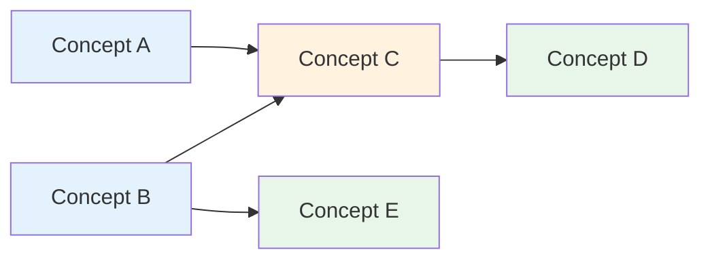
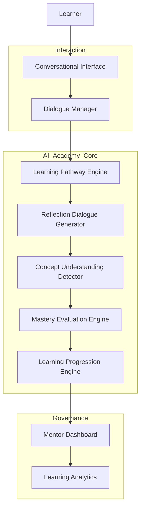
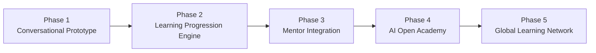

# AI Academy Engine
### Whitepaper: Architecture for Guided AI Learning Systems

## 1. Executive Summary

Recent advances in large language models have transformed artificial intelligence into powerful knowledge engines capable of answering complex questions across many domains. While this unprecedented access to information creates new opportunities for self‑directed learning, it also introduces new challenges. Instant answers do not necessarily translate into deep understanding. Learners may obtain explanations without engaging in reflection, application, or conceptual validation.

The **AI Academy Engine** is proposed as a new learning infrastructure that transforms conversational AI from a simple answer provider into a guided learning progression system. Instead of merely responding to questions, the AI Academy Engine guides learners through structured exploration, reflective dialogue, and mastery evaluation.

The system combines conversational AI with structured learning progression and **Human‑in‑the‑Loop (HITL) mentorship**, allowing AI to monitor learning trajectories while mentors adapt learning strategies when necessary. In this model, learning progression is not strictly linear and learners may advance across multiple topics simultaneously based on conceptual mastery rather than fixed class progression.

This whitepaper outlines the conceptual framework, system architecture, learning model, and governance structure required to implement an AI Academy Engine.

---

# 2. Problem Statement

## 2.1 AI as a Knowledge Engine

Modern conversational AI systems function primarily as **knowledge engines**. Learners ask questions and receive explanations instantly. This model dramatically improves access to knowledge but does not inherently ensure meaningful learning progression.

Typical conversational interaction follows a simple pattern:

Question → Answer → Topic Shift

In this pattern, learning may remain superficial because the system does not verify whether the learner has truly understood the concept.

## 2.2 Illusion of Understanding

Educational psychology has long recognized the risk of **illusion of explanatory depth**, where individuals believe they understand a concept more deeply than they actually do. Instant AI explanations may unintentionally reinforce this illusion if no reflective process is required.

## 2.3 Lack of Structured Progression

Traditional education systems organize knowledge through structured progression:

Concept Introduction → Practice → Reflection → Mastery → Progression

Conversational AI environments typically lack these mechanisms, resulting in fragmented learning experiences.

---

# 3. Vision: From Knowledge Engines to Learning Engines

The AI Academy Engine introduces a paradigm shift:

Knowledge Engine → Learning Engine

Instead of acting as a passive responder, AI becomes a **learning progression guide** that actively supports conceptual development.

Key principles include:

• Learning through dialogue and reflection
• Multi‑topic learning progression
• Conceptual mastery detection
• Adaptive learning pathways
• Human mentor oversight

---

# 4. AI Academy Engine Framework

## 4.1 Multi‑Topic Learning Progression

Unlike traditional classroom structures that follow a single linear curriculum, the AI Academy Engine supports **multi‑topic and multi‑level learning progression**.

Learners may explore several related topics simultaneously, advancing faster in areas where understanding develops quickly while remaining at earlier conceptual stages in topics requiring deeper reflection.

This flexible structure allows learning trajectories such as:

Topic A → Level 3
Topic B → Level 1
Topic C → Level 4

Learning therefore becomes **adaptive rather than linear**.

In addition, learning materials within the AI Academy Engine are **not strictly sequential**. Traditional education systems often require learners to complete Topic A before moving to Topic B. In contrast, the AI Academy Engine allows learners to explore concepts in a non‑linear order depending on curiosity, relevance, or emerging understanding. The AI continuously maps conceptual relationships between topics and ensures that missing prerequisite concepts are gradually introduced through dialogue and exploration rather than enforced through rigid curriculum sequences.

Importantly, remaining at a certain level is not interpreted as failure. Instead, the system monitors conceptual development over time.

Conceptual Learning Graph

This diagram illustrates how learning in the AI Academy Engine follows a **conceptual graph** rather than a rigid sequential curriculum. Learners may enter the graph from different concepts and progressively connect ideas as their understanding develops.

## 4.2 Human‑in‑the‑Loop Mentorship

Mentors play an essential role in the system. While AI monitors conceptual progression and identifies patterns such as stagnation or inconsistency, mentors interpret these signals and may adjust learning strategies.

Mentors may:

• introduce alternative learning pathways
• assign observation‑based tasks
• facilitate peer discussion
• provide targeted conceptual guidance

This hybrid model ensures that AI enhances rather than replaces human pedagogical judgment.

---

# 5. Conversational Learning Model

## 5.1 Conversational Entry Point

Every learning journey begins with a conversational entry point in which the AI asks learners what they already know about a topic.

Example prompt:

"What do you already know about supply chain systems?"

The learner's response becomes the starting point for exploration.

## 5.2 Adaptive Learning Pathways

The AI Academy Engine offers multiple learning pathways depending on learner preference and learning style.

Possible pathways include:

Dialogue‑based exploration

Learners discuss concepts with the AI through guided questions.

Observation‑based learning

Learners observe real‑world systems and return to discuss their findings.

Visual exploration

AI provides diagrams or simulations.

Problem‑solving challenges

Learners apply knowledge through practical scenarios.

---

# 6. Reflective Dialogue and Mastery Detection

A central feature of the AI Academy Engine is **reflective dialogue**.

Instead of evaluating isolated answers, the system evaluates **conceptual consistency across multiple conversational interactions**.

Learners may be asked to:

• explain concepts in their own words
• analyze hypothetical scenarios
• compare alternative explanations
• apply concepts to real‑world cases

Mastery is inferred from the **stability of conceptual reasoning** rather than the correctness of a single response.

---

# 7. 360‑Degree Conceptual Evaluation

To reduce superficial learning, the AI Academy Engine evaluates understanding from multiple conceptual perspectives.

Example probing angles include:

Definition
Example
Analogy
Scenario application
Comparison
Reflection

If learner responses remain coherent across these perspectives, the system infers conceptual mastery.

---

# 8. System Architecture

The AI Academy Engine can be described as a layered architecture.

System Architecture Overview

This architecture diagram shows how learner interaction flows through the conversational interface into the AI Academy Engine core, where conceptual reasoning and mastery evaluation occur. Mentors interact through governance tools that monitor learning trajectories.

Learner Layer

User interaction and conversational responses.

Conversational Interaction Layer

Dialogue management, prompt generation, response interpretation.

AI Academy Engine Core

Learning pathway selector
Reflection dialogue generator
Conceptual understanding detector
Mastery evaluation engine
Learning progression engine

Mentor Governance Layer

Mentor dashboards monitor learner progression and allow pedagogical intervention.

---

# 9. Implementation Model: AI Open Academy

The AI Academy Engine can enable a new model of education similar to an **AI‑augmented open university**.

Learners subscribe to learning programs organized around topics rather than traditional academic semesters.

Learning progression is determined by:

Conceptual mastery
Time to mastery
Learning trajectory

Instead of grading students by examination scores, progression is measured by **how long it takes learners to achieve stable conceptual understanding**.

---

# 10. Ethical and Governance Considerations

AI‑driven learning environments require responsible governance.

Key principles include:

Transparent data collection
Informed learner consent
Protection of learning data
Responsible use of cognitive analytics

Maintaining trust between learners, institutions, and AI systems is essential.

---

# 11. Roadmap for Implementation

Implementation Roadmap

The AI Academy Engine can be implemented progressively through several development phases. Each phase expands the system’s capability while validating pedagogical effectiveness and technical feasibility.

Phase 1 — Conversational Learning Prototype

• AI chatbot capable of structured learning dialogue
• Topic-based learning modules
• Reflective questioning system
• Basic learner interaction logging

In this stage, the goal is to validate the conversational learning model and observe how learners interact with AI-guided exploration.

Phase 2 — Learning Progression Engine

• Concept-level progression tracking
• Multi-topic learning state per learner
• Non-linear concept dependency mapping
• Early mastery detection models

This phase introduces the AI Academy Engine core that evaluates conceptual understanding over time rather than relying on isolated answers.

Phase 3 — Mentor Integration (Human-in-the-Loop)

• Mentor dashboards for learner monitoring
• Intervention tools for mentors
• Learning stagnation alerts
• Adaptive learning pathway adjustments

Human mentors become active participants in guiding learning trajectories while AI provides analytical insight.

Phase 4 — AI Open Academy Platform

• Subscription-based learning programs
• Community learning environments
• Peer discussion integration
• Certification based on conceptual mastery

At this stage, the platform operates similarly to an AI-augmented open university where learners progress through conceptual mastery rather than traditional grading systems.

Phase 5 — Global Learning Network

• Cross-institution collaboration
• Interconnected knowledge graphs
• AI-personalized learning ecosystems
• Lifelong learning identity systems

This final phase envisions the AI Academy Engine evolving into a global learning infrastructure where individuals continuously develop knowledge across disciplines.

---

# 12. Future Research Directions

Several research areas remain open:

Reliable conversational mastery detection
Adaptive learning pathway optimization
AI‑supported mentor dashboards
Long‑term effects on learning motivation

These areas represent opportunities for interdisciplinary collaboration between AI researchers, educators, and learning scientists.

---

# 13. Conclusion

The rapid evolution of conversational AI presents an opportunity to rethink how learning systems are designed. The AI Academy Engine proposes a new model in which AI systems do not merely answer questions but guide learners through structured journeys of conceptual exploration and mastery.

By combining conversational AI, adaptive learning pathways, and human mentorship, the AI Academy Engine has the potential to transform AI from a knowledge access tool into a foundational infrastructure for future learning ecosystems.
