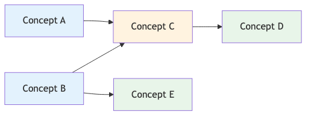

# 4. AI Academy Engine Framework

## 4.1 Multi‑Topic Learning Progression

Unlike traditional classroom structures that follow a single linear curriculum, the AI Academy Engine supports **multi‑topic and multi‑level learning progression**.

Learners may explore several related topics simultaneously, advancing faster in areas where understanding develops quickly while remaining at earlier conceptual stages in topics requiring deeper reflection.

This flexible structure allows learning trajectories such as:

Topic A → Level 3
Topic B → Level 1
Topic C → Level 4

Learning therefore becomes **adaptive rather than linear**.

In addition, learning materials within the AI Academy Engine are **not strictly sequential**. Traditional education systems often require learners to complete Topic A before moving to Topic B. In contrast, the AI Academy Engine allows learners to explore concepts in a non‑linear order depending on curiosity, relevance, or emerging understanding. The AI continuously maps conceptual relationships between topics and ensures that missing prerequisite concepts are gradually introduced through dialogue and exploration rather than enforced through rigid curriculum sequences.

Importantly, remaining at a certain level is not interpreted as failure. Instead, the system monitors conceptual development over time.

Conceptual Learning Graph

{ height=7.5cm }

This diagram illustrates how learning in the AI Academy Engine follows a **conceptual graph** rather than a rigid sequential curriculum. Learners may enter the graph from different concepts and progressively connect ideas as their understanding develops.

## 4.2 Human‑in‑the‑Loop Mentorship

Mentors play an essential role in the system. While AI monitors conceptual progression and identifies patterns such as stagnation or inconsistency, mentors interpret these signals and may adjust learning strategies.

Mentors may:

• introduce alternative learning pathways
• assign observation‑based tasks
• facilitate peer discussion
• provide targeted conceptual guidance

This hybrid model ensures that AI enhances rather than replaces human pedagogical judgment.

---
