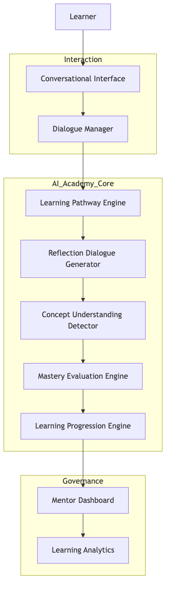

# 8. System Architecture

The AI Academy Engine can be described as a layered architecture.

System Architecture Overview

{ height=8cm }

This architecture diagram shows how learner interaction flows through the conversational interface into the AI Academy Engine core, where conceptual reasoning and mastery evaluation occur. Mentors interact through governance tools that monitor learning trajectories.

Learner Layer

User interaction and conversational responses.

Conversational Interaction Layer

Dialogue management, prompt generation, response interpretation.

AI Academy Engine Core

Learning pathway selector
Reflection dialogue generator
Conceptual understanding detector
Mastery evaluation engine
Learning progression engine

Mentor Governance Layer

Mentor dashboards monitor learner progression and allow pedagogical intervention.

---
